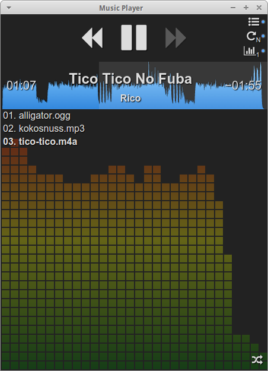

# mp: a hybrid music player

[Click here to try it online!](http://ondras.github.io/mp/dist/web/)



This is a music player built on web technologies. It can be used as a standalone cross-platform application (using [nw.js](http://nwjs.io/) or [Electron](http://electron.atom.io/)) or as a web page.

The trick here is that **the code base is shared: the very same application code that runs the web page is used in a standalone app**.

## Features, planned and implemented

- [x] Sound playback
  - [x] Supported formats: all that your {browser,Electron,nw.js} supports
  - [x] Routing to WebAudio graph
- [x] Playlist
  - [x] Basic control
  - [x] Recursive import
  - [x] Repeat
  - [x] Drag/drop reordering
  - [x] Shuffle
- [x] Playback control & info
  - [x] Waveform
  - [x] Metadata parsing
    - [x] ID3v1
    - [x] ID3v2
    - [x] Vorbis comments
    - [x] m4a/mp4
  - [x] Seeking
  - [x] Album art
  - [x] Global hotkeys
- [x] Miscellaneous
  - [x] Realtime visuals
    - [x] Spectrum analyser
    - [x] *Big Psyco* from *Visual Player for DOS*
  - [x] Single instance runtime playlist control
  - [x] Single instance runtime playback control

## Running

1. Clone this project
2. Run it:
  - adjust and run `dist/electron/mp.sh [path-to-song-or-playlist]`
  - adjust and run `dist/nw/mp.sh [path-to-song-or-playlist]`
  - launch `dist/web/index.html`
  
The web version is also hosted at [GitHub pages](http://ondras.github.io/mp/dist/web/).

## Command line API
```
[-p] play1.mp3 play2.mp3 ... -q enqueue1.mp3 enqueue2.mp3 ... -c command1 command2
```

Where `command` is `play`, `pause`, `prev` or `next`.

Web version can be controlled by `postMessage` with the following data object:
```js
{
  command: "control",
  argv: ["array", "of", "command", "line", "arguments"]
}
```

## Compiling

1. Clone this project
2. `npm install`
3. `make`

## Achievements unlocked
  - Playback via `HTMLAudioElement` through `Web Audio` sound graph
  - Waveform visuals via `decodeAudioData`
  - Realtime visuals using `AnalyserNode`
  - Metadata parsing thanks to `XHR2`, `ArrayBuffer`, `DataView` and `TextDecoder` APIs
  - Written in ES2015, bundled using Rollup and good ol' Make
  - CSS compiled with LESS
